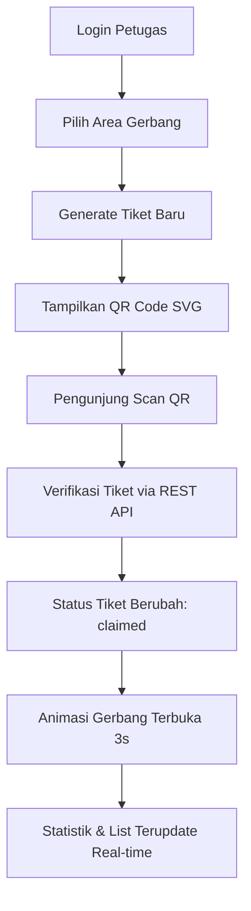

# ParkFinder — Web QR Generator

[](https://react.dev/)
[](https://vite.dev/)
[](https://tailwindcss.com/)
[](https://firebase.google.com/)

**Web QR Generator** adalah subsistem frontend kiosk/desktop dari ekosistem **ParkFinder** (Platform Manajemen Parkir). Aplikasi web ini dirancang khusus untuk berjalan di komputer gerbang masuk parkir, memungkinkan petugas/admin gerbang mencetak atau menayangkan e-tiket masuk berbasis QR Code secara instan, serta memantau status palang pintu secara real-time.

---

## 1. Project Overview
Aplikasi ini ditujukan bagi petugas gerbang masuk parkir. Fungsinya meliputi:
- Pembuatan tiket masuk instan untuk kendaraan mobil/motor.
- Penayangan QR Code statis yang berisi plain string tiket ID untuk dipindai oleh pengunjung (via Web User atau Mobile PWA).
- Sinkronisasi status tiket secara real-time dengan Firestore database. Jika tiket berhasil diverifikasi oleh pengunjung, gerbang akan secara otomatis menampilkan visualisasi palang pintu terbuka selama 3 detik sebelum kembali ke mode idle.
- Dashboard statistik aktivitas harian dan daftar tiket aktif di area gerbang tersebut.

---

## 2. Features
- **Aman dengan JWT**: Sesi login/logout terproteksi token JWT yang dikirimkan via header Authorization Axios.
- **Pemuatan Area Cerdas**: Area gerbang dapat dipilih lewat dropdown selector di header dan otomatis di-cache ke dalam penyimpanan lokal (`localStorage`).
- **Generator Tiket Instan**: Form generate tiket masuk yang mengirim payload parameter areaId ke REST API.
- **Render QR Code Murni**: QR Code SVG statis yang dibuat berisi *plain string ID* tiket tanpa embel-embel JSON atau URL, menjamin kompatibilitas verifikasi multi-platform.
- **Countdown Timer**: Tiket masuk yang dibuat memiliki sisa waktu aktif selama 10 menit (600 detik).
- **Real-time Gate Controller**: Menggunakan Firestore `onSnapshot` listener untuk memantau perubahan status tiket dan memicu animasi gerbang terbuka 3 detik.
- **Tabel Tiket Aktif**: Memantau daftar tiket yang aktif dan belum di-scan, serta fitur pembatalan tiket.
- **Dashboard Overview**: Counter dinamis (Tiket Hari Ini, Tiket Aktif, Tiket Sukses) dan log riwayat aktivitas.

---

## 3. Tech Stack
- **Library Utama**: React 19 (JavaScript)
- **Bundler & Dev Server**: Vite
- **Styling & Theme**: TailwindCSS v4 & Custom CSS variables
- **HTTP Client**: Axios (dengan Request Interceptor JWT)
- **Real-time Sync**: Firebase Client SDK v11 (Cloud Firestore)
- **Ikon UI**: Lucide React
- **QR Code Rendering**: `qrcode.react` (QRCodeSVG)

---

## 4. Installation
Ikuti langkah-langkah berikut untuk menjalankan project secara lokal:

1. **Clone repository**:
   ```bash
   git clone https://github.com/username/webGenerateQrcode.git
   cd webGenerateQrcode
   ```

2. **Instal dependensi**:
   ```bash
   npm install
   ```

3. **Jalankan dev server**:
   ```bash
   npm run dev
   ```

4. **Build untuk produksi**:
   ```bash
   npm run build
   ```

---

## 5. Environment Variables
Buat file `.env` di direktori root project untuk konfigurasi integrasi Firebase dan API:

```env
# URL API Backend ParkFinder
VITE_API_BASE_URL=https://backend-api-services-173368161554.asia-southeast2.run.app

# Firebase Configuration
VITE_FIREBASE_API_KEY=your_firebase_api_key
VITE_FIREBASE_AUTH_DOMAIN=your_firebase_auth_domain
VITE_FIREBASE_PROJECT_ID=your_firebase_project_id
VITE_FIREBASE_STORAGE_BUCKET=your_firebase_storage_bucket
VITE_FIREBASE_MESSAGING_SENDER_ID=your_firebase_messaging_sender_id
VITE_FIREBASE_APP_ID=your_firebase_app_id
```

---

## 6. Folder Structure
Struktur direktori utama aplikasi ini dirancang teratur untuk kemudahan pemeliharaan:

```text
webGenerateQrcode/
├── public/                     # Asset statis publik
├── src/
│   ├── components/             # Reusable UI Components
│   │   ├── ActiveTicketsList.jsx   # List tabel tiket aktif
│   │   ├── DashboardOverview.jsx   # Kartu stats & aktivitas terbaru
│   │   ├── StatusBadge.jsx         # Status indicator badge
│   │   └── TicketGenerator.jsx     # Form generator & visual palang gerbang
│   ├── config/                 # Konfigurasi library pihak ketiga
│   │   ├── axios.js                # Setup base URL & interceptor token JWT
│   │   └── firebase.js             # Inisialisasi Firebase & Firestore db
│   ├── hooks/                  # Custom React Hooks
│   │   └── useTicketListener.js    # Firestore onSnapshot ticket listener
│   ├── pages/                  # Halaman Router level
│   │   ├── Dashboard.jsx           # Main page controller & sidebar layout
│   │   └── Login.jsx               # Form login admin gerbang
│   ├── App.css                 # Style global tambahan
│   ├── App.jsx                 # Setup Routing & Protected Route
│   ├── index.css               # Setup Tailwind & CSS custom variable theme
│   ├── main.jsx                # React DOM entry point
│   └── assets/
├── package.json
└── vite.config.js
```

---

## 7. Business Flow
Alur integrasi transaksi tiket masuk digital ParkFinder digambarkan dalam diagram berikut:



---

## 8. API Integration
Berikut adalah ringkasan API endpoint yang terintegrasi di Web QR Generator:

| Method | Endpoint | Auth | Fungsi |
| :--- | :--- | :--- | :--- |
| `POST` | `/auth/login` | No | Validasi email/password petugas dan memberikan JWT. |
| `POST` | `/auth/logout` | Yes | Memutus sesi token di sisi server. |
| `GET` | `/areas` | Yes | Memuat seluruh daftar wilayah parkir aktif. |
| `POST` | `/gate/generateTicket` | Yes | Menginisiasi tiket masuk baru dengan status `pending` di area tertentu. |

---

## 9. Screenshot Section
Untuk melengkapi penyusunan berkas dokumentasi atau BAB 4 Skripsi, berikut adalah daftar rancangan tangkapan layar sistem yang dapat diambil:

1. **Halaman Login**: Menampilkan form autentikasi petugas masuk.
2. **Dashboard Overview**: Menampilkan data statistik tiket hari ini dan aktivitas terbaru.
3. **Form Generator (Idle)**: Tampilan tombol inisiasi generate tiket.
4. **QR Code Tampil (Generated)**: QR Code statis murni dengan timer countdown 10 menit.
5. **Sukses Pintu Terbuka (Claimed)**: Visual sukses gerbang terbuka setelah tiket berhasil di-scan.
6. **Daftar Tiket Aktif**: Tabel data list tiket pending yang sedang berjalan.

---

## 10. Current Status
Aplikasi telah selesai dikembangkan secara fungsional. Fitur pembuatan tiket, rendering QR, monitoring realtime, statistik dashboard, dan area caching berjalan normal. Seluruh skenario alur utama telah teruji sukses dan siap dideploy ke lingkungan produksi.
