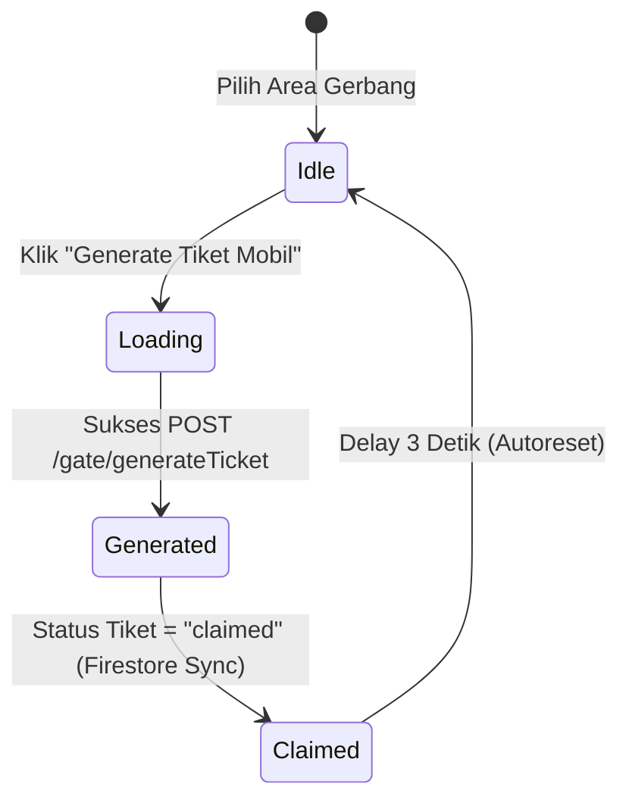

# ParkFinder — Web QR Generator

[](https://react.dev/)
[](https://vite.dev/)
[](https://tailwindcss.com/)
[](https://firebase.google.com/)

**Web QR Generator** adalah subsistem frontend kiosk/desktop dari platform **ParkFinder** (Manajemen Parkir). Dirancang khusus untuk berjalan di komputer kiosk pintu gerbang masuk parkir, aplikasi ini memungkinkan petugas/admin gerbang mencetak e-tiket masuk berbasis QR Code secara instan dan memantau status gerbang secara real-time.

---

## 1. Inventori Halaman (Page Directory)

Aplikasi ini menggunakan arsitektur Single Page Application (SPA) minimalis dengan rute terproteksi. Berikut adalah daftar halaman yang ada di project ini:

### 🔑 1. Halaman Login (`/login`)
*   **Komponen**: `src/pages/Login.jsx`
*   **Fungsi**: Autentikasi petugas pintu gerbang masuk parkir sebelum diizinkan mengakses panel kontrol generator.
*   **Fitur**:
    *   Form autentikasi email & password dengan penanganan loading spinner saat proses otentikasi.
    *   Error handling visual berupa banner peringatan jika kredensial salah atau terjadi kesalahan jaringan.
    *   Pemuatan area otomatis dari endpoint API REST setelah login berhasil untuk kemudian di-cache secara lokal.

### 📊 2. Halaman Dashboard Kiosk Utama (`/`)
*   **Komponen**: `src/pages/Dashboard.jsx` (Rute Terproteksi)
*   **Fungsi**: Halaman utama yang mengoordinasikan status login, selektor gerbang wilayah parkir aktif, dan memuat penayangan pencetak tiket.
*   **Fitur**:
    *   **Header Control**: Selektor dropdown area gerbang aktif yang menyimpan status pilihan ke `localStorage` (`selectedAreaId`).
    *   **Kiosk Module Integration**: Merender langsung komponen utama **`TicketGenerator.jsx`** secara penuh di tengah layar.

---

## 2. Struktur Alur Generator & Deteksi Gerbang (`TicketGenerator.jsx`)

Komponen `TicketGenerator` yang dimuat pada halaman utama mengadopsi 4 status tampilan utama (*State-driven UI*):



1.  **Tampilan IDLE**:
    *   Form tombol inisiasi pembuatan e-tiket masuk kendaraan.
2.  **Tampilan LOADING**:
    *   Animasi loading spinner saat mengirimkan request API pembuatan tiket baru ke backend.
3.  **Tampilan GENERATED (QR Code Tampil)**:
    *   Menampilkan QR Code SVG yang berisi **Plain String ID Tiket Murni** (misal: `PF-1778311698768-9a9162aa`).
    *   Menampilkan rincian metadata tiket (tipe kendaraan, plat nomor jika terdaftar, nama pengunjung, dan jam pembuatan).
    *   **Countdown Timer**: Penghitung mundur masa berlaku tiket selama 10 menit (600 detik).
    *   **Cancel & Reset**: Tombol membatalkan tiket langsung ke Firestore database (`status: "cancelled"`) dan tombol selesai untuk mereset layar kembali ke mode Idle.
4.  **Tampilan CLAIMED (Pintu Terbuka)**:
    *   Menggunakan Firestore `onSnapshot` real-time listener untuk memantau perubahan status dokumen tiket.
    *   Jika status berubah menjadi `claimed` (karena pengunjung memindai dan melakukan booking via Web User/Mobile), antarmuka akan memicu visualisasi sukses **"Gerbang Terbuka"** berwarna hijau selama 3 detik sebelum otomatis mereset diri kembali ke tampilan Idle.

---

## 3. Tech Stack & Dependencies

*   **Framework**: React 19 (JavaScript)
*   **Tooling/Bundler**: Vite & Rolldown
*   **Styling**: TailwindCSS v4
*   **HTTP Client**: Axios (dengan Interceptor JWT terotomatisasi)
*   **Real-time Sync**: Firebase SDK v12 (Cloud Firestore Client)
*   **Ikon UI**: Lucide React
*   **QR Generator**: `qrcode.react` (QRCodeSVG)

---

## 4. Struktur Folder Project

Struktur folder utama dirancang terstruktur dan terisolasi untuk kemudahan pemeliharaan:

```text
webGenerateQrcode/
├── public/                     # Asset statis
├── src/
│   ├── components/             # Reusable UI Components
│   │   └── TicketGenerator.jsx     # Modul generator tiket & animasi pintu gerbang
│   ├── config/                 # Konfigurasi library & instansiasi pihak ketiga
│   │   ├── axios.js                # Setup base URL Axios & Interceptor header JWT
│   │   └── firebase.js             # Setup inisialisasi Firebase & Firestore db
│   ├── hooks/                  # Custom React Hooks
│   │   └── useTicketListener.js    # Firestore onSnapshot listener
│   ├── pages/                  # Halaman Router level
│   │   ├── Dashboard.jsx           # Main page controller & dropdown area selector
│   │   └── Login.jsx               # Halaman autentikasi admin gerbang
│   ├── App.css                 # Global custom styles
│   ├── App.jsx                 # Setup Routing & Protected Route guard
│   ├── index.css               # Import Tailwind & CSS custom variable theme
│   └── main.jsx                # React DOM entry point
├── package.json
└── vite.config.js
```

---

## 5. Cara Instalasi & Menjalankan Project

### Prerequisites
*   Node.js versi LTS (`v18` atau yang lebih baru direkomendasikan)
*   NPM / Yarn

### Langkah Setup

1.  **Clone repository & masuk ke direktori**:
    ```bash
    cd webGenerateQrcode
    ```

2.  **Instal dependensi**:
    ```bash
    npm install
    ```

3.  **Konfigurasi Environment**:
    Buat file `.env.local` pada root project dengan isi:
    ```env
    # URL API REST Backend
    VITE_API_BASE_URL=https://backend-api-services-173368161554.asia-southeast2.run.app

    # Firebase SDK config
    VITE_FIREBASE_API_KEY=your_firebase_api_key
    VITE_FIREBASE_AUTH_DOMAIN=your_firebase_auth_domain
    VITE_FIREBASE_PROJECT_ID=your_firebase_project_id
    VITE_FIREBASE_STORAGE_BUCKET=your_firebase_storage_bucket
    VITE_FIREBASE_MESSAGING_SENDER_ID=your_firebase_messaging_sender_id
    VITE_FIREBASE_APP_ID=your_firebase_app_id
    ```

4.  **Jalankan Server Development**:
    ```bash
    npm run dev
    ```

5.  **Build untuk Produksi**:
    ```bash
    npm run build
    ```
