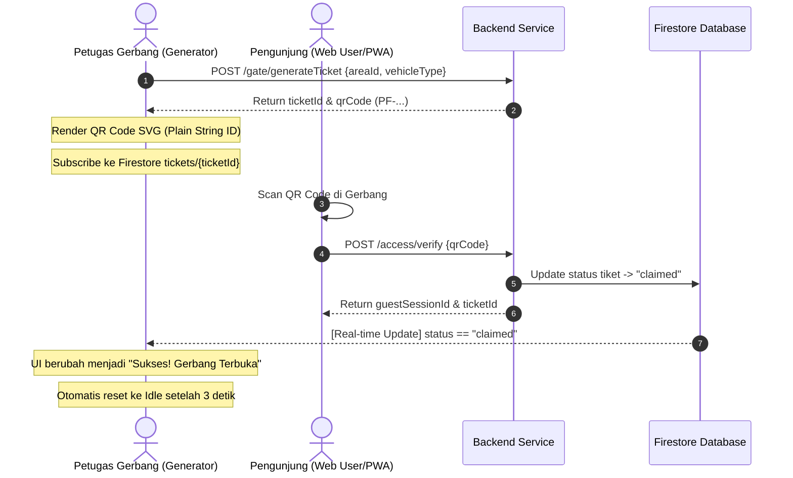

# ParkFinder — Web QR Generator

## Deskripsi Project

**Web QR Generator** adalah salah satu dari 3 subsistem frontend dalam ekosistem **ParkFinder** (Platform Manajemen Parkir). Aplikasi web ini dirancang khusus untuk berjalan di perangkat gerbang parkir (desktop/kiosk) dan digunakan oleh admin/petugas gerbang untuk menghasilkan tiket masuk berbasis QR Code secara instan.

### Fungsi Utama
1. **Generate Tiket Masuk**: Membuat tiket masuk baru berdasarkan pilihan area gerbang dan tipe kendaraan (Default: Mobil).
2. **Pencetakan/Penayangan QR Code**: Menghasilkan QR Code statis berisi kode tiket murni untuk dipindai oleh pengunjung (Web User / Mobile App).
3. **Real-time Gate Controller**: Mendengarkan perubahan status tiket secara real-time via Firestore. Ketika tiket berhasil di-scan dan divalidasi oleh pengunjung (status berubah menjadi `claimed`), gerbang otomatis terbuka secara visual di sistem.
4. **Daftar Tiket Aktif & Pembatalan**: Melihat semua tiket aktif di area tersebut dan membatalkannya jika diperlukan.

---

## Spesifikasi QR Code & Kontrak API

Agar kompatibel dengan backend API `/access/verify` dan modul Web User, format isi QR Code telah distandardisasi:

### 1. Format Isi QR Code
QR Code yang dihasilkan berisi **String ID Tiket Murni** (bukan URL dan bukan JSON).
*   **Contoh Nilai**: `PF-1778311698768-9a9162aa`
*   **Implementasi di Frontend (`TicketGenerator.jsx`)**:
    ```javascript
    <QRCodeSVG
      value={ticketData.qrCode || ticketData.ticketId}
      size={200}
      level="H"
      includeMargin={true}
    />
    ```
    *Catatan: Nilai QR Code tidak boleh dibungkus dengan `JSON.stringify` agar backend dapat membacanya langsung.*

### 2. Endpoint API Terkait
*   **Mendapatkan Area Parkir**:
    *   **Method**: `GET`
    *   **URL**: `/areas`
    *   **Deskripsi**: Digunakan untuk mengisi dropdown pilihan area gerbang di header.
*   **Generate Tiket**:
    *   **Method**: `POST`
    *   **URL**: `/gate/generateTicket`
    *   **Payload**:
        ```json
        {
          "areaId": "ID_AREA_DARI_DROPDOWN",
          "vehicleType": "mobil"
        }
        ```
    *   **Respons Sukses**:
        ```json
        {
          "success": true,
          "data": {
            "ticketId": "nsU3bSvIsiF06GsltvCH",
            "qrCode": "PF-1778311698768-9a9162aa",
            "vehicleType": "mobil",
            "status": "pending",
            "createdAt": "..."
          }
        }
        ```
*   **Verifikasi Tiket (Oleh Web User / Mobile App saat memindai)**:
    *   **Method**: `POST`
    *   **URL**: `/access/verify`
    *   **Payload**: `{ "qrCode": "PF-1778311698768-9a9162aa" }`

---

## Arsitektur & Teknologi

### Tech Stack
*   **Core**: React 19 (JavaScript), Vite (Bundler)
*   **Styling**: TailwindCSS 4, Custom inline styling
*   **State Management**: React State (`useState`) & Effects (`useEffect`)
*   **Real-time Database Connection**: Firebase SDK (Firestore client)
*   **HTTP Client**: Axios

### Struktur Folder Utama
```
webGenerateQrcode/
  ├── public/                   # Asset statis
  ├── src/
  │    ├── components/
  │    │    ├── ActiveTicketsList.jsx    # Tabel daftar tiket yang berstatus aktif/pending
  │    │    ├── DashboardOverview.jsx    # Kartu statistik ringkasan tiket hari ini
  │    │    ├── StatusBadge.jsx          # Badge status tiket (Aktif, Sukses, Dibatalkan, dsb.)
  │    │    └── TicketGenerator.jsx      # Form generate, render QR Code, dan visualisasi gate open
  │    ├── config/
  │    │    ├── axios.js                 # Konfigurasi base URL axios ke backend
  │    │    └── firebase.js              # Inisialisasi Firebase app dan Firestore db
  │    ├── hooks/
  │    │    └── useTicketListener.js     # Custom hook real-time listener status tiket
  │    ├── pages/
  │    │    ├── Dashboard.jsx            # Main page coordinator & layout sidebar/header
  │    │    └── Login.jsx                # Form login admin gerbang
  │    ├── App.jsx                       # Routing & provider wrapper
  │    └── main.jsx                      # Entry point React
  ├── package.json
  └── vite.config.js
```

---

## Alur Data & Siklus Hidup Tiket (Data Flow)



1. **Inisiasi Tiket**: Admin memilih area gerbang (misal: "Lantai 1") dan tipe kendaraan, lalu mengklik "Generate". Tiket dibuat dengan status `pending`/`active`.
2. **Listening**: Aplikasi langsung memanggil hook `useTicketListener(ticketId)` yang melakukan `onSnapshot` di Firestore pada dokumen `tickets/{ticketId}`.
3. **Scanning & Verification**: Pengunjung memindai QR Code menggunakan kamera smartphone. Data string murni hasil scan dikirim ke API Backend `/access/verify`.
4. **State Transition**: Backend memproses verifikasi, menandai tiket sebagai `claimed`, dan menyimpan perubahan tersebut ke Firestore.
5. **Gate Response**: Generator QR mendeteksi pembaruan status tersebut secara instan melalui listener. Layar generator menampilkan status sukses dan memberikan sinyal visual bahwa gerbang dibuka. Setelah 3 detik, layar mereset kembali ke keadaan semula untuk memproses kendaraan berikutnya.

---

## Environment Variables (Konfigurasi)

Buat file `.env` di direktori root project untuk menghubungkan frontend ke Firebase dan Backend API:

```env
VITE_API_URL=https://backend-api-services-291631508657.asia-southeast2.run.app
VITE_FIREBASE_API_KEY=your_api_key
VITE_FIREBASE_AUTH_DOMAIN=your_auth_domain
VITE_FIREBASE_PROJECT_ID=your_project_id
VITE_FIREBASE_STORAGE_BUCKET=your_storage_bucket
VITE_FIREBASE_MESSAGING_SENDER_ID=your_messaging_sender_id
VITE_FIREBASE_APP_ID=your_app_id
```
