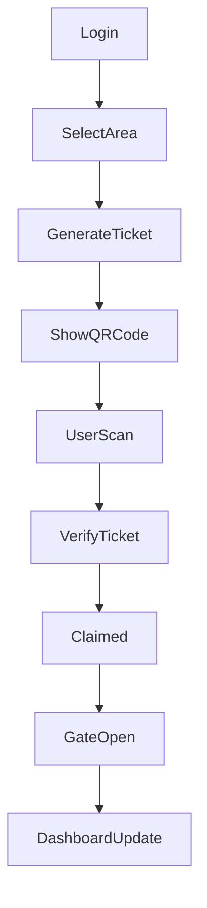

# Task DOC-0001 — README & Page Documentation Generator

## Context

Project: **ParkFinder — Web QR Generator**

Sebelum mengerjakan tugas ini, WAJIB membaca:

1. `agents.md`
2. Seluruh hasil audit:

   * 0002 Authentication Audit
   * 0003 Generate Ticket Contract Verification
   * 0004 QR Rendering & Verification
   * 0005 Firestore Listener & Gate Open Verification
   * 0006 Dashboard & Ticket Management Audit
   * 0007 Ticket Cancellation Audit
   * 0008 Multi Area Audit
   * 0009 Error Recovery Audit
   * 0010 Authorization Audit
   * 0011 Feature Completeness Audit

Tujuan tugas ini adalah membuat dokumentasi final yang dapat digunakan untuk:

* README project GitHub
* Dokumentasi internal project
* Referensi BAB 4 Skripsi
* Daftar screenshot implementasi sistem

---

## Objective

Buat dokumentasi lengkap mengenai:

1. Deskripsi sistem
2. Arsitektur singkat
3. Daftar halaman
4. Daftar komponen utama
5. Daftar fitur
6. Alur bisnis
7. Daftar screenshot yang harus diambil
8. Struktur project
9. Teknologi yang digunakan

---

## Step 1 — Inventory Page

Identifikasi seluruh halaman pada project.

Audit folder:

```text
src/pages
src/components
```

Tentukan:

```text
Halaman Utama
Sub Tampilan
Dialog
Widget
```

---

## Step 2 — Page Documentation

Untuk setiap halaman buat dokumentasi:

### Nama Halaman

### Tujuan

### Fitur

### Endpoint yang digunakan

### Komponen yang digunakan

### Screenshot yang diperlukan

Contoh format:

```text
Halaman Login

Tujuan:
Autentikasi petugas gerbang.

Fitur:
- Login
- Error Handling
- Loading State

Endpoint:
POST /auth/login

Screenshot:
- Tampilan Login
- Error Login
- Loading Login
```

---

## Step 3 — Screenshot Mapping

Buat tabel:

| No | Nama Screenshot | Halaman | Keterangan |
| -- | --------------- | ------- | ---------- |

Contoh:

| 1 | Login Page | Login | Tampilan awal login |
| 2 | Dashboard Overview | Dashboard | Statistik tiket |
| 3 | QR Generated | Dashboard | QR berhasil dibuat |

Tujuan tabel ini adalah mempermudah penyusunan BAB 4.

---

## Step 4 — Feature Documentation

Dokumentasikan seluruh fitur:

### Authentication

* Login
* Logout
* Session Management

### Area Management

* Dropdown Area
* Area Persistence

### Ticket Generator

* Generate Ticket
* QR Code
* Copy Ticket
* Countdown

### Realtime Monitoring

* Firestore Listener
* Gate Open

### Ticket Management

* Active Ticket List
* Cancel Ticket

---

## Step 5 — Business Flow

Buat diagram Mermaid:



---

## Step 6 — README Generation

Generate file:

```text
README.md
```

yang berisi:

1. Project Overview
2. Features
3. Tech Stack
4. Installation
5. Environment Variables
6. Folder Structure
7. Business Flow
8. API Integration
9. Screenshot Section
10. Current Status

---

## Step 7 — BAB 4 Mapping

Buat file:

```text
documentation/page-mapping.md
```

Isi:

### Halaman Login

Screenshot:

* Login Normal
* Login Error

Sub Bab Skripsi:

* Implementasi Login

---

### Dashboard Generator

Screenshot:

* Dashboard
* Statistik
* Generate Tiket
* QR Code
* Gate Open
* Active Ticket List

Sub Bab Skripsi:

* Implementasi Dashboard Generator

---

## Deliverables

Generate:

```text
README.md
documentation/page-documentation.md
documentation/page-mapping.md
```

---

## Success Criteria

* Seluruh halaman teridentifikasi.
* Seluruh fitur terdokumentasi.
* README siap publish.
* Daftar screenshot siap digunakan untuk BAB 4.
* Dokumentasi sesuai implementasi aktual project.
