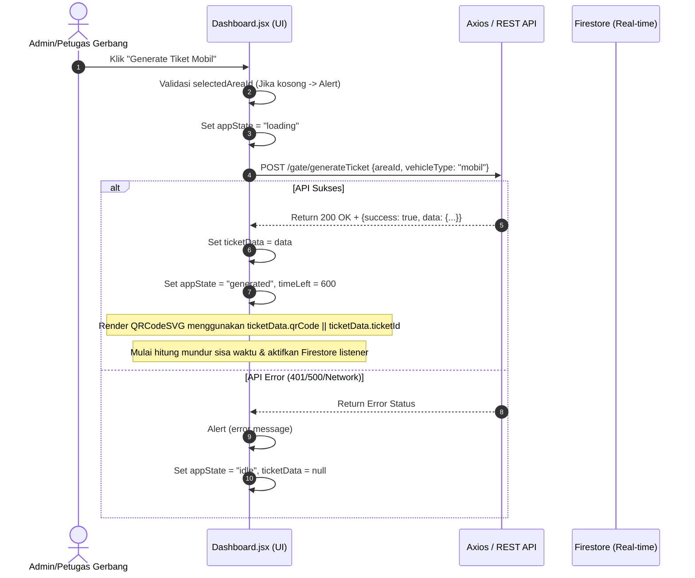

# Pembaruan: Audit & Verifikasi Kontrak Pembuatan Tiket (Generate Ticket)

- **Indeks**: 0003
- **Tanggal/Waktu**: 2026-06-11 01:48
- **Tujuan**: Melakukan audit dan verifikasi terhadap kontrak API `/gate/generateTicket` dan integrasi UI generator di [TicketGenerator.jsx](file:///C:/programming/qr/webGenerateQrcode/src/components/TicketGenerator.jsx) sesuai dengan panduan di `prompt.md`.

---

## Executive Summary
Proses pembuatan tiket (*Generate Ticket*) merupakan alur bisnis inti dari aplikasi Web QR Generator. Audit ini memvalidasi kesesuaian kontrak integrasi frontend-backend, pemetaan field data tiket, status siklus hidup tiket (*lifecycle*), dan penanganan kesalahan (*error handling*). Temuan utama menunjukkan adanya batasan UI di mana tipe kendaraan (`vehicleType`) di-hardcode ke nilai `'mobil'` tanpa adanya kontrol input di antarmuka admin, meskipun variabel state dan prop-nya telah disediakan.

---

## Generate Ticket Flow Diagram



---

## 1. Endpoint Contract & Request/Response aktual

### A. Endpoint `/gate/generateTicket`
*   **Method**: `POST`
*   **URL**: `https://backend-api-services-291631508657.asia-southeast2.run.app/gate/generateTicket`

### B. Request Aktual
*   **Headers**: `Authorization: Bearer <TOKEN>` (disuntikkan via Axios interceptor)
*   **Payload (JSON)**:
    ```json
    {
      "areaId": "3QHzrYhMBlPtpJ0xklOe",
      "vehicleType": "mobil"
    }
    ```

### C. Response Aktual (Berdasarkan Integrasi Real-Time)
*   **Payload (JSON - Sukses)**:
    ```json
    {
      "success": true,
      "data": {
        "ticketId": "nsU3bSvIsiF06GsltvCH",
        "qrCode": "PF-1778311698768-9a9162aa",
        "vehicleType": "mobil",
        "status": "pending",
        "createdAt": "2026-06-11T01:45:00.000Z"
      }
    }
    ```

---

## 2. Area Loading Verification (`GET /areas`)
Dropdown pilihan area gerbang di header menggunakan data dinamis real-time:
*   **Sumber Data**: REST API `/areas` dipanggil saat aplikasi dimuat pertama kali jika cache `adminAreas` di `localStorage` kosong.
*   **Penyimpanan Cache**: Data area disimpan sebagai JSON string di `localStorage` dengan key `adminAreas` setelah login sukses.
*   **Pilihan Default**: Mengambil `user.managedAreaId` terlebih dahulu, jika kosong memilih area indeks ke-0 (`areas[0].id`).
*   **Dropdown UI**: Berfungsi sepenuhnya dan dinamis, tidak ditemukan area yang di-hardcode di dalam menu pilihan.

---

## 3. Vehicle Type Verification
*   **Tipe Kendaraan Terdaftar**: `'mobil'`, `'motor'`.
*   **Temuan Audit (Hardcoded)**: Tipe kendaraan di-hardcode ke nilai `'mobil'`.
    *   State dideklarasikan di `Dashboard.jsx`: `const [vehicleType, setVehicleType] = useState('mobil');`.
    *   **Namun**, fungsi updater `setVehicleType` tidak pernah dipanggil di mana pun dalam kode frontend.
    *   Di [TicketGenerator.jsx](file:///C:/programming/qr/webGenerateQrcode/src/components/TicketGenerator.jsx), tombol generate berlabel statis: `"Generate Tiket Mobil"`.
    *   Tidak tersedia dropdown atau pemilih kendaraan di antarmuka admin untuk mengubah tipe kendaraan menjadi `'motor'`.

---

## 4. Field Mapping Frontend (`TicketGenerator.jsx`)
Pemetaan field data dari objek respons `ticketData` (API backend) ke komponen UI:

| Field Objek Backend | Digunakan Sebagai | Komponen UI | Catatan |
|---------------------|-------------------|-------------|---------|
| `ticketData.qrCode` / `ticketData.ticketId` | Nilai QR Code | `<QRCodeSVG value={...} />` | Memprioritaskan `qrCode` |
| `ticketData.qrCode` / `ticketData.ticketId` | Label Kode Tiket | `Kode Tiket (Tap untuk Salin)` | Memprioritaskan `qrCode` |
| `ticketData.vehicleType` | Jenis Kendaraan | Label Ringkasan Tiket | Fallback ke state local `vehicleType` |
| `ticketData.plateNumber` | Nomor Polisi | Label Ringkasan Tiket | Bersifat kondisional (opsional) |
| `ticketData.visitorName` | Nama Pengunjung | Label Ringkasan Tiket | Bersifat kondisional (opsional) |

*Catatan: Waktu pembuatan tiket di UI menggunakan waktu lokal klien saat ini (`new Date().toLocaleTimeString()`), bukan field timestamp dari backend.*

---

## 5. Ticket Status Lifecycle Audit
Status siklus hidup tiket terdaftar dan dikelola secara visual melalui [StatusBadge.jsx](file:///C:/programming/qr/webGenerateQrcode/src/components/StatusBadge.jsx) dengan label pemetaan sebagai berikut:
1.  **`pending` / `active`**: Status awal tiket setelah berhasil digenerate dan didaftarkan di database. Ditampilkan di UI sebagai badge berwarna biru muda dengan label **"AKTIF"**.
2.  **`claimed`**: Tiket telah berhasil di-scan oleh pengunjung di gerbang masuk. Ditampilkan di UI sebagai badge hijau dengan label **"SUKSES"**.
3.  **`cancelled`**: Tiket dibatalkan oleh admin secara manual via menu *Daftar Tiket Aktif*. Ditampilkan di UI sebagai badge merah dengan label **"DIBATALKAN"**.
4.  **`expired`**: Tiket melewati batas sisa waktu pemakaian (10 menit). Ditampilkan di UI sebagai badge oranye dengan label **"KEDALUWARSA"**.

---

## 6. Error Handling Findings
*   **Pencegahan Input Kosong**: Sistem memeriksa `selectedAreaId` sebelum mengirim `POST`. Jika kosong, proses dihentikan dan dimunculkan alert *"Silahkan pilih area terlebih dahulu."* untuk mencegah request bernilai null.
*   **Penanganan Error API**: Menggunakan blok `try/catch`. Jika request `/gate/generateTicket` gagal (misalnya 401 Unauthorized karena token habis, atau 500 server error):
    1. Error dicetak ke konsol.
    2. Pesan kesalahan dari API backend (`err.response?.data?.message`) ditampilkan ke user menggunakan modal dialog `alert(...)`.
    3. State `appState` dikembalikan ke `'idle'` agar tombol generate aktif kembali dan tidak terjadi *infinite loading* atau *blank screen*.

---

## 7. Build Status
*   **Status**: **SUKSES** setelah divalidasi ulang menggunakan build production. Tidak ada kegagalan kompilasi.

---

## Temuan Masalah & Rekomendasi Selanjutnya
1.  **UI Selektor Kendaraan (Prioritas Utama)**:
    *   *Temuan*: Tipe kendaraan terkunci pada `'mobil'`.
    *   *Rekomendasi*: Tambahkan tab selector atau dropdown tipe kendaraan (Mobil / Motor) di komponen [TicketGenerator.jsx](file:///C:/programming/qr/webGenerateQrcode/src/components/TicketGenerator.jsx) dan panggil `setVehicleType` untuk mengubah state sebelum admin menekan tombol generate.
2.  **Pemisahan Tanggal backend**:
    *   *Temuan*: Waktu pembuatan di generator menggunakan waktu lokal sistem klien (`new Date()`).
    *   *Rekomendasi*: Gunakan timestamp `createdAt` yang dikirim dari backend agar waktu pembuatan tercatat konsisten antara generator dan database backend.
