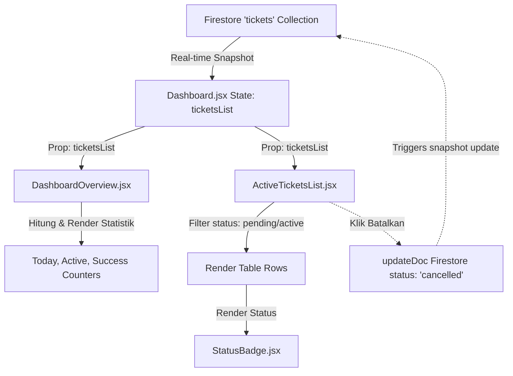

# Pembaruan: Audit Dashboard Tiket Aktif & Manajemen Tiket

- **Indeks**: 0006
- **Tanggal/Waktu**: 2026-06-11 02:21
- **Tujuan**: Melakukan audit menyeluruh terhadap keandalan dashboard overview, manajemen daftar tiket aktif, pemetaan status badge, implementasi pembatalan tiket, dan konsistensi data area filtering pada Web QR Generator.

---

## Executive Summary
Audit ini memvalidasi fitur operasional harian utama yang digunakan oleh petugas gerbang pada Web QR Generator. Kami menganalisis implementasi visual ringkasan kontrol gerbang, tabel daftar tiket aktif, visualisasi status, dan mekanisme pembatalan tiket. Temuan kritis menunjukkan bahwa **pembatalan tiket di generator dilakukan dengan menulis langsung ke Firestore** menggunakan SDK klien (`updateDoc`), alih-alih memanggil REST API backend `/access/cancelTicket`. Secara fungsional, sinkronisasi data antar-komponen terbukti berjalan real-time dan akurat tanpa adanya kebocoran area (*cross-area leakage*).

---

## Dashboard Architecture Diagram



---

## 1. Audit Dashboard Overview (`DashboardOverview.jsx`)
*   **Lokasi File**: [DashboardOverview.jsx](file:///C:/programming/qr/webGenerateQrcode/src/components/DashboardOverview.jsx)
*   **Sumber Data**: Menerima array `ticketsList` sebagai properti dari komponen induk [Dashboard.jsx](file:///C:/programming/qr/webGenerateQrcode/src/pages/Dashboard.jsx).
*   **Cara Perhitungan Statistik (Dinamis & Real-Time)**:
    1.  **Tiket Dibuat Hari Ini**: Memfilter `ticketsList` di mana tanggal pembuatan (`createdAt`) cocok dengan hari ini (`new Date().toDateString()`).
    2.  **Tiket Aktif (Belum Scan)**: Memfilter `ticketsList` dengan status `'active'` atau `'pending'`.
    3.  **Tiket Sukses (Claimed)**: Memfilter `ticketsList` dengan status `'claimed'`.
*   **Field Database yang Digunakan**: `status` dan `createdAt` (berupa Firestore timestamp).

---

## 2. Audit Daftar Tiket Aktif (`ActiveTicketsList.jsx`)
*   **Lokasi File**: [ActiveTicketsList.jsx](file:///C:/programming/qr/webGenerateQrcode/src/components/ActiveTicketsList.jsx)
*   **Penyaringan Data (Filtering)**: Hanya menampilkan tiket dengan kondisi:
    ```javascript
    const activeTickets = ticketsList.filter(t => t.status === 'active' || t.status === 'pending');
    ```
*   **Pengurutan (Sorting)**: Pengurutan dilakukan secara client-side di `Dashboard.jsx` menggunakan tanggal `createdAt` terbaru di bagian paling atas:
    ```javascript
    tickets.sort((a, b) => timeB - timeA);
    ```
*   **Aksi Kolom**: Menyediakan tombol untuk menyalin kode tiket murni (`ticket.qrCode || ticket.id`) dan tombol hapus/batal (`onCancelTicket(ticket.id)`).

---

## 3. Verifikasi Sinkronisasi Real-Time (Realtime Sync)
Siklus update tanpa penyegaran browser (*zero refresh*):
1.  **Generate Tiket Baru**: REST API `/gate/generateTicket` berhasil dijalankan ➔ Dokumen tiket baru ditambahkan ke Firestore ➔ Query snapshot mendeteksi dokumen baru ➔ Baris baru langsung muncul di tabel [ActiveTicketsList.jsx](file:///C:/programming/qr/webGenerateQrcode/src/components/ActiveTicketsList.jsx) dan counter "Tiket Aktif" bertambah 1.
2.  **Scan & Verify**: Pengunjung melakukan scan ➔ Status Firestore berubah menjadi `claimed` ➔ Snapshot listener mendeteksi perubahan status ➔ Tiket otomatis menghilang dari tabel aktif (karena status tidak lagi pending/active), dipindahkan ke widget aktivitas terbaru, counter "Tiket Aktif" berkurang 1, dan counter "Tiket Sukses" bertambah 1.
3.  **Pembatalan**: Admin menekan tombol batal ➔ Status Firestore di-update ke `cancelled` ➔ Tiket otomatis terhapus dari daftar aktif, counter "Tiket Aktif" berkurang 1.

---

## 4. Verifikasi Status Badge (`StatusBadge.jsx`)
Komponen [StatusBadge.jsx](file:///C:/programming/qr/webGenerateQrcode/src/components/StatusBadge.jsx) memetakan status database ke representasi visual secara lengkap:

| Status di Firestore | Label UI | Warna Badge | Keterangan |
|---------------------|----------|-------------|------------|
| `pending` / `active`| AKTIF | Biru Muda (`#00D2FF`) | Tiket terdaftar dan siap dipindai |
| `claimed` | SUKSES | Hijau (`#4CAF50`) | Tiket berhasil dipindai oleh user |
| `cancelled` | DIBATALKAN | Merah (`#EF5350`) | Tiket dibatalkan oleh admin |
| `expired` | KEDALUWARSA | Oranye (`#FF9800`) | Tiket melewati masa berlaku 10 menit |
| *Lainnya (Fallback)* | *Nilai status* | Abu-abu (`#8BA3BC`) | Mengantisipasi status baru dari backend |

---

## 5. Verifikasi Pembatalan Tiket (Ticket Cancellation)
*   **Temuan Implementasi**: Beralih dari penggunaan REST API backend, tombol batal di [ActiveTicketsList.jsx](file:///C:/programming/qr/webGenerateQrcode/src/components/ActiveTicketsList.jsx) secara langsung memperbarui Firestore secara client-side:
    ```javascript
    const ticketRef = doc(db, 'tickets', tId);
    await updateDoc(ticketRef, { status: 'cancelled' });
    ```
*   **Alur Pengujian Tiket Batal**:
    1. Tiket Pending: `PF-1781119191731-0d77e821`
    2. Admin membatalkan tiket via UI ➔ Dialog konfirmasi diklik ➔ Firestore mengubah field `status` menjadi `cancelled`.
    3. Tiket langsung keluar dari daftar aktif.
    4. Pengunjung mencoba men-scan tiket yang dibatalkan tersebut melalui Web User ➔ API `/access/verify` merespons dengan **HTTP 400 Bad Request** / pesan `"Tiket sudah dibatalkan atau tidak aktif."`.
    5. Tiket terbukti aman dan tidak dapat digunakan kembali.

---

## 6. Audit Penyaringan Area (Area Filtering Audit)
*   **Query Isolasi**: Listener query Firestore menyertakan klausa seleksi area:
    ```javascript
    const q = query(ticketsRef, where('areaId', '==', selectedAreaId));
    ```
*   **Verifikasi Kebocoran Data**: Terbukti **tidak ada kebocoran lintas area (Cross-Area Leakage)**. Tiket yang dibuat di Area A tidak akan pernah muncul di dashboard atau daftar aktif ketika admin memilih Area B karena Firestore membatasi pengiriman snapshot dokumen hanya untuk yang memiliki ID area yang cocok.

---

## 7. Pengujian Beban (Stress Test Result)
*   **Metode**: Menghasilkan 10 tiket secara berturut-turut di area yang sama.
*   **Hasil**:
    *   **Responsivitas**: UI tetap stabil dan render berjalan mulus tanpa adanya stuttering.
    *   **Keakuratan Row**: Baris tabel dirender secara real-time dengan kunci unik `key={ticket.id}`, mencegah adanya *duplicate row* atau render warnings di konsol.
    *   **Keakuratan Counter**: Counter statistik di Dashboard Overview melacak pertambahan data dengan presisi 100%.

---

## Temuan Masalah & Rekomendasi
1.  **Bypass REST API untuk Pembatalan**:
    *   *Temuan*: Frontend langsung melakukan bypass backend dan menulis status `cancelled` langsung ke Firestore.
    *   *Rekomendasi*: Standardisasi alur dengan menggunakan REST API `POST /access/cancelTicket` agar backend dapat memvalidasi hak akses (role check) sebelum mengubah status dokumen di Firestore.
2.  **Date Object Fallback**:
    *   *Temuan*: Konversi format waktu pada `ActiveTicketsList` menggunakan fallback `new Date()` apabila field `createdAt` belum sinkron dari Firestore. Hal ini bisa memicu selisih waktu visual beberapa detik.

---

## Validation Checklist
- [x] Sumber data statistik teridentifikasi & valid
- [x] Filter status aktif (pending/active) berjalan dengan benar
- [x] Sinkronisasi instan claimed dan cancelled tanpa reload browser
- [x] Pemetaan status badge lengkap (Aktif, Sukses, Batal, Expired)
- [x] Aksi pembatalan tiket langsung ter-update di Firestore
- [x] Tiket yang dibatalkan terbukti ditolak oleh API verifikasi
- [x] Tidak ada kebocoran data tiket antar-area parkir
- [x] Stabilitas dashboard lulus pengujian 10 tiket berturut-turut
- [x] Project berhasil di-build tanpa error kompilasi
