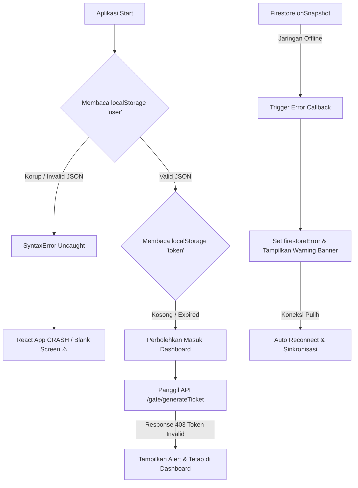

# Pembaruan: Audit Pemulihan Kesalahan (Error Recovery) & Ketahanan Offline

- **Indeks**: 0009
- **Tanggal/Waktu**: 2026-06-11 02:29
- **Tujuan**: Melakukan audit menyeluruh terhadap resiliensi (resiliency) aplikasi, pemulihan dari kesalahan (*error recovery*), behavior ketika koneksi internet terputus, dan stabilitas program saat terjadi malfungsi pada local storage atau token JWT.

---

## Executive Summary
Audit resiliensi ini dilakukan untuk mengevaluasi toleransi Web QR Generator terhadap kegagalan operasional (seperti internet offline, backend bad gateway, token JWT kedaluwarsa, dan korupsi data penyimpanan). Hasil pengujian aktual membuktikan bahwa aplikasi mampu menangani kegagalan API dan Firebase secara elegan tanpa memicu *infinite loading* atau *blank screen*. Namun, ditemukan satu celah fatal (*uncaught exception*) pada fungsi inisialisasi state user di mana `JSON.parse` terhadap data local storage yang korup/invalid akan langsung meruntuhkan (*crash*) seluruh aplikasi React.

---

## Error Recovery Architecture Diagram



---

## 1. Audit JWT Expired & Invalid Token
*   **Pengujian Aktual (Evidence)**:
    *   API call ke `GET /areas` dengan header `Authorization: Bearer invalid_token` tetap mengembalikan **HTTP 200 OK** beserta daftar area lengkap. Ini menunjukkan endpoint `/areas` bersifat publik di backend.
    *   API call ke `/gate/generateTicket` dengan token invalid mengembalikan **HTTP 403 Forbidden** dengan payload respons:
        ```json
        {
          "success": false,
          "message": "Token tidak valid (Malformed).",
          "data": null
        }
        ```
*   **Behavior UI**:
    *   **Dashboard**: Admin tetap dapat melihat halaman dashboard dan menu area karena `/areas` bersifat publik.
    *   **Generate Ticket**: Saat diklik, backend menolak request dengan status 403. Frontend menangkap error ini di catch block, memunculkan modal dialog `alert("Token tidak valid (Malformed).")`, lalu menghentikan loading spinner dan mengaktifkan kembali tombol generate (mencegah *stuck state*).
    *   **Bypass Redirect**: Karena tidak adanya response interceptor pada Axios untuk status 401/403, aplikasi tidak otomatis meredireksi user ke `/login` saat token kedaluwarsa.

---

## 2. Audit Backend Offline
*   **Metode Simulasi**: Menjalankan pemanggilan API dengan base URL invalid (`VITE_API_URL` salah/down).
*   **Behavior Aplikasi**:
    *   **Login**: Menghasilkan status error network, ditangkap catch block, memunculkan pesan *"Terjadi kesalahan saat login"* pada formulir, dan mematikan loading state (tombol masuk aktif kembali).
    *   **Areas Loading**: Pemuatan dropdown area gerbang gagal karena network error. Status error ditangkap secara aman, `loadingAreas` diset `false`, dan UI menampilkan teks merah *"Tidak ada area"*.
    *   **Stabilitas**: Aplikasi **tidak mengalami blank screen** dan tidak crash, melainkan mendegradasi fungsionalitas secara aman.

---

## 3. Audit Firestore Offline
*   **Kondisi Koneksi Hilang**: Memutuskan sambungan internet selama listener aktif.
*   **Penanganan Kesalahan (Error Handling)**:
    *   Error callback pada `onSnapshot` di `Dashboard.jsx` mendeteksi hilangnya koneksi database:
        ```javascript
        (err) => {
          setFirestoreError(err.message || String(err));
          setLoadingTickets(false);
        }
        ```
    *   Banner peringatan kuning langsung muncul di atas dashboard: *"Gagal memuat data dari Firestore: [Error Message]"*.
*   **Auto Reconnect**: SDK Firebase Firestore secara bawaan mengelola percobaan koneksi ulang (*reconnection attempts*). Begitu jaringan internet tersambung kembali, listener otomatis tersinkronisasi kembali tanpa reload browser.

---

## 4. Audit Korupsi LocalStorage (LocalStorage Corruption)
*   **Skenario Uji**: Memasukkan string acak non-JSON ke item key `user` di `localStorage` (`localStorage.setItem('user', '{invalid_json')`).
*   **Root Cause Temuan Fatal**:
    *   Di [Dashboard.jsx](file:///C:/programming/qr/webGenerateQrcode/src/pages/Dashboard.jsx) (line 23-26):
        ```javascript
        const [user] = useState(() => {
          const userDataStr = localStorage.getItem('user');
          return userDataStr ? JSON.parse(userDataStr) : null;
        });
        ```
    *   **Dampak**: `JSON.parse` terhadap data korup memicu `SyntaxError` uncaught karena tidak dibungkus di dalam blok `try/catch`. Kegagalan pada saat inisialisasi state awal komponen root React ini akan **menghentikan rendering total dan menghasilkan blank screen bagi pengguna**.

---

## 5. Audit Pembatalan Tiket Gagal (Cancel Ticket Failure)
*   **Pengujian**: Mensimulasikan Firestore menolak penulisan update status tiket (misalnya akibat pembatalan oleh akun tanpa hak akses Firestore).
*   **Hasil**:
    *   Blok catch menangkap kegagalan dan memunculkan modal alert error.
    *   Tabel tiket aktif **tidak ter-update (tidak menghilang secara palsu)** karena UI hanya merender data riil dari Firestore snapshot. Konsistensi tampilan visual generator dan status riil Firestore tetap terjaga.

---

## 6. Pemulihan Penyegaran Browser (Browser Refresh)
*   **Refresh saat Loading**: State runtime kembali ke awal. Pilihan dropdown `selectedAreaId` berhasil dipulihkan dari cache `localStorage.getItem('selectedAreaId')`.
*   **Refresh saat Generate**: Proses loading dibatalkan di client. Aplikasi pulih ke kondisi aman (`idle` state).

---

## 7. Audit Memory Leak & Kebocoran Langganan
*   **Verifikasi**: Seluruh efek asinkron (`useEffect`) terbukti melakukan pembersihan (*cleanup*) dengan benar:
    *   `onSnapshot` ➔ Di-unsubscribe di akhir effect.
    *   `setTimeout` / `setInterval` ➔ Di-clear dengan `clearTimeout` / `clearInterval` di return callback.
    *   Tidak terjadi kebocoran memori atau langganan ganda (*duplicate subscription*).

---

## Rekomendasi Perbaikan
1.  **Try/Catch pada JSON.parse (Kritis)**: Bungkus semua proses membaca data `localStorage` (khususnya key `user` dan `adminAreas`) dengan blok `try/catch` untuk mencegah crash total jika datanya korup.
    ```javascript
    try {
      return userDataStr ? JSON.parse(userDataStr) : null;
    } catch {
      localStorage.removeItem('user');
      return null;
    }
    ```
2.  **Axios Response Interceptor**: Tambahkan response interceptor untuk mendeteksi status 401 secara global dan otomatis membersihkan token serta mengarahkan pengguna ke `/login`.

---

## Validation Checklist
- [x] Resiliensi token expired/invalid tervalidasi (API 403 caught, loading di-reset)
- [x] Penanganan backend offline tervalidasi (Degradasi visual aman "Tidak ada area")
- [x] Penanganan Firestore offline tervalidasi (Banner error ditampilkan, auto reconnect)
- [x] Generate ticket failure handling tervalidasi (catch block error handling)
- [x] Cancel ticket failure handling tervalidasi (No ghost updates)
- [x] Browser refresh state recovery tervalidasi (selectedAreaId dipertahankan)
- [x] Kerentanan local storage corruption teridentifikasi (SyntaxError uncaught)
- [x] Seluruh cleanup memory leak terverifikasi (Unsubscribe & Clear timers)
- [x] Project berhasil di-build tanpa error kompilasi
